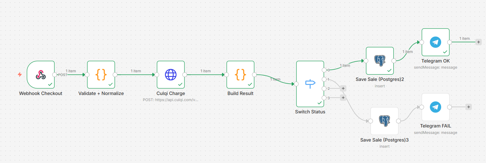

# Automatización de Pagos con Culqi usando n8n

Este proyecto implementa un sistema automatizado para procesar pagos utilizando la API de Culqi mediante workflows en n8n.

El sistema recibe solicitudes de pago a través de un webhook, valida los datos recibidos, ejecuta el cargo mediante la API de Culqi y procesa el resultado de la transacción. Posteriormente registra el estado del pago en una base de datos PostgreSQL y envía una notificación a través de Telegram.

---

# Objetivo del Proyecto

El objetivo de este proyecto es desarrollar un flujo automatizado capaz de:

- Procesar pagos utilizando la API de Culqi
- Validar y normalizar datos de pago
- Automatizar la respuesta de transacciones
- Registrar pagos en una base de datos
- Notificar el resultado de la transacción

Este proyecto forma parte de un portafolio enfocado en automatización de procesos e integración de APIs.

---

# Tecnologías Utilizadas

- n8n – Automatización de workflows
- Culqi API – Procesamiento de pagos
- PostgreSQL – Almacenamiento de transacciones
- Telegram Bot API – Notificaciones
- Docker – Gestión de contenedores
- HTML, CSS y JavaScript – Interfaz web de prueba
- Webhooks – Recepción de solicitudes de pago

---

# Arquitectura del Sistema

El flujo general del sistema es el siguiente:

Cliente → Página web → Webhook → n8n → API Culqi → Evaluación del estado → PostgreSQL → Notificación Telegram

---

# Flujo de Funcionamiento

1. El usuario completa el formulario de pago en la página web.
2. La página envía los datos de pago al webhook del sistema.
3. El workflow en n8n valida y normaliza los datos recibidos.
4. Se realiza una solicitud a la API de Culqi para procesar el cargo.
5. El sistema recibe la respuesta de la transacción.
6. Se determina si el pago fue exitoso o fallido.
7. El resultado se almacena en PostgreSQL.
8. Se envía una notificación a Telegram indicando el estado del pago.

---

# Workflow de Automatización

El siguiente diagrama muestra el flujo implementado en n8n.

---

# Seguridad y Configuración de Claves

Por razones de seguridad, las claves de la API de Culqi no están incluidas en este repositorio.

Cada usuario debe configurar sus propias credenciales antes de ejecutar el proyecto.

Las claves necesarias son:

- Public Key de Culqi (utilizada en la página web para generar el token de pago)
- Secret Key de Culqi (utilizada en el workflow de n8n para procesar el cargo)

Estas claves deben configurarse manualmente en:

- el archivo del frontend donde se inicializa Culqi
- las credenciales o variables utilizadas dentro del workflow de n8n

